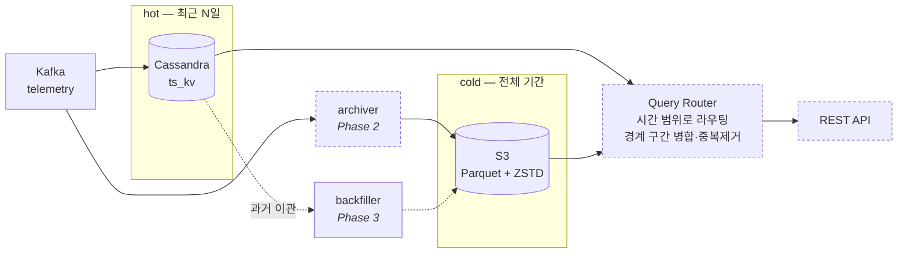

# ts-tiering

[](https://github.com/cafe-jun/ts-tiering/actions/workflows/build.yml)
[](LICENSE)

IoT 시계열 데이터를 hot(Cassandra) / cold(S3 Parquet) 계층으로 나누고,
**조회하는 쪽은 그 경계를 모르게** 만드는 티어링 계층.

> 상태: **Phase 1 측정 완료** (남은 것: 블로그 발행) — [계획](docs/PHASE1.md) · [벤치마크](docs/benchmark/README.md) · [ADR](docs/adr/)
> AWS 는 쓰지 않는다. Athena 비교는 수행하지 않았고 그 사실을 [PHASE1.md](docs/PHASE1.md) 에 명시했다.

## 문제

IoT 시계열은 접근 빈도가 극단적으로 비대칭이다.
최근 데이터는 대시보드가 초당 수백 번 읽고, 6개월 전 데이터는 한 달에 몇 번 읽는다.
그런데 둘 다 같은 저장소에서 같은 GB당 비용을 낸다.

## 구조



cold 계층의 객체 키는 [ADR-0004](docs/adr/0004-partition-scheme.md) 가 정한다.

```
s3://bucket/tenant=<uuid>/date=<YYYY-MM-DD>/key=<키>/part-N.parquet
  → tenant_id, device_id, ts, value       (키별 단일 타입, ADR-0002)
  → 파일 안에서 (device_id, ts) 정렬, Parquet v2
```

**Phase 1 은 위 그림에서 `S3` 상자 하나만 검증한다.** Kafka·Cassandra·라우터는
Phase 2 이후이고, 지금은 합성 데이터를 직접 Parquet 으로 써서 저장·조회 특성만 측정했다.

## 모듈

| 모듈 | 역할 | Phase |
|---|---|---|
| `core` | 도메인 모델, 파티션 규칙 인터페이스 | 1 |
| `storage-parquet` | Parquet 쓰기 (Hadoop 없이), 푸터 파싱 | 1 |
| `storage-s3` | S3 I/O | 1 |
| `bench` | 합성 데이터 생성 + 벤치마크 하네스 | 1 |
| `archiver` | Kafka → Parquet → S3 (스트림) | 2 |
| `query` | hot/cold 라우팅 + REST API | 2 |
| `storage-cassandra` | Cassandra 읽기 전용 | 2 |
| `backfiller` | Cassandra → S3 과거 데이터 이관 | 3 |
| `compactor` | 작은 파일 병합 | 3 |
| `reconciler` | 원본/아카이브 정합성 검증 | 3 |

## 설계 결정

- [ADR-0001 — Parquet 라이브러리와 Hadoop 의존성](docs/adr/0001-parquet-library.md)
- [ADR-0002 — 텔레메트리 값의 Parquet 표현](docs/adr/0002-value-layout.md)
- [ADR-0003 — 쿼리 엔진](docs/adr/0003-query-engine.md)
- [ADR-0004 — 파티션 스킴](docs/adr/0004-partition-scheme.md)

## 벤치마크

**[docs/benchmark/](docs/benchmark/README.md) 에 전체 결과와 재현 방법이 정리되어 있다.**

- [W1 기준선](docs/benchmark/w1-baseline.md) — 합성 데이터 생성기와 값 분포 검증
- [W2 레이아웃 × 코덱](docs/benchmark/w2-parquet-layout.md) — PER_KEY_TYPED + ZSTD 채택 근거
- [W3 granularity 프로브](docs/benchmark/w3-partition-granularity.md) — 시 단위 파티션이 일 단위보다 **2.83배 크다**
- [W3 S3 적재](docs/benchmark/w3-s3-ingest.md) — 1년치 **134,028,000 건 → 132.0 MiB / 5,475 객체**
- [W3 Cassandra 기준선](docs/benchmark/w3-cassandra-baseline.md) — 같은 데이터가 `ts_kv` 로 **11.79 bytes/행**
- [W4 DuckDB 조회](docs/benchmark/w4-duckdb-baseline.md) — 프루닝은 99.4% 걸리는데 **지연은 객체 나열이 지배한다**
- [W5~W6 파티션 스킴](docs/benchmark/w5-partition-schemes.md) — 디바이스 파티션은 **바이트 26배 절감, 지연 43배 악화**
- [W6 보강 — 매니페스트](docs/benchmark/w6-manifest-vs-glob.md) — 카탈로그가 프루닝까지 하면 순위가 뒤집힌다 (**182배**)

### 핵심 수치

같은 1년치 데이터(134,028,000 건, 디바이스 51대, 60초 주기)를 저장했을 때:

| | 크기 | 행당 |
|---|---|---|
| Cassandra `ts_kv` (RF=1) | 약 1.47 GiB | 11.79 B |
| **Parquet + ZSTD (S3)** | **132.0 MiB** | **1.02 B** |

**11.5배.** RF=3 이면 약 34배이고, TTL 을 걸면 Cassandra 쪽이 더 커지므로 이 값은 하한이다.

> NDJSON 대비 190배라는 숫자도 나오지만 인용하지 말 것 — Cassandra 자체가 이미 NDJSON 을
> 16.7배 압축하고 있어서, 그 배수의 대부분은 "JSON 이 뚱뚱했다"는 뜻일 뿐이다.

조회 쪽에서 반복해서 나온 결론은 하나다. **이 규모에서 비용은 바이트가 아니라 객체 수에 붙는다** —
업로드는 객체당 4.4ms, 조회는 나열만으로 531ms, 디바이스 파티션은 바이트를 26배 줄이고도
지연이 43배다. 파티션 설계보다 파일 목록을 나열하지 않는 구조(매니페스트 카탈로그)가 먼저다.

## 개발

```bash
./gradlew build                                                    # 빌드 + 테스트
./gradlew :bench:generate --args="--count=10_000_000 --out=data/raw-10m.ndjson"
./gradlew :bench:parquetBench --args="--count=10_000_000"      # 레이아웃 × 코덱 비교

# 로컬 S3(MinIO) 필요 — docker compose -f deploy/docker-compose.dev.yml up -d
./gradlew :bench:ingest --args="--days=365 --devices-per-tenant=17 --interval-seconds=60 --s3=true"
./gradlew :bench:query  --args="--iterations=20"               # 쿼리 3종 p50/p95 + 프루닝

# Cassandra 기준선 — docker compose -f deploy/docker-compose.dev.yml up -d cassandra
./gradlew :bench:cassandraBaseline --args="--days=30 --devices-per-tenant=17 --interval-seconds=60"
```

Java 17 / Gradle 8.10.2 (wrapper 사용).

## 라이선스

[Apache License 2.0](LICENSE)
